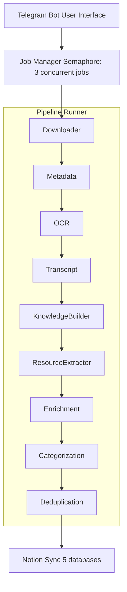

<div align="center">
  <h1>🚀 Resource Scrapper (KnowledgeFlow)</h1>
  <p><strong>Turn Instagram Reels, YouTube videos, and social media posts into structured, searchable knowledge — automatically.</strong></p>

  <p>
    <a href="#-features">Features</a> •
    <a href="#-architecture">Architecture</a> •
    <a href="#-quick-start">Quick Start</a> •
    <a href="SETUP.md">Notion Setup</a>
  </p>
</div>

---

Resource Scrapper (internally known as KnowledgeFlow) is a **multi-agent AI pipeline** that extracts knowledge from social media content and organizes it into a Notion workspace. Paste a link in a Telegram bot, and the system downloads the media, transcribes audio, extracts text via OCR, identifies key topics and resources, and syncs everything to your Notion databases.

## ✨ Features

| Feature | Description |
|---|---|
| **🤖 Telegram Bot Interface** | Send a reel/video URL to the bot and get a structured knowledge summary back. |
| **🎬 Multi-Platform Support** | Instagram Reels, YouTube videos, X/Twitter posts, LinkedIn articles. |
| **🔊 Audio Transcription** | Transcribes video audio via Google AI Studio (Gemini multimodal). |
| **👁️ OCR Extraction** | Captures and reads on-screen text from video frames using EasyOCR. |
| **🧩 AI Knowledge Extraction** | Uses LLMs to extract topics, key takeaways, summaries, and resources. |
| **📚 Notion Sync** | Creates structured entries across 5 Notion databases (Sources, Knowledge, Resources, Creators, Categories). |
| **🔗 Resource Detection** | Identifies books, tools, courses, and links mentioned in content. |
| **🏷️ Auto-Categorization** | Tags, difficulty levels, and category assignment via LLM. |
| **🚫 Deduplication** | Fuzzy matching prevents duplicate entries in your knowledge base. |
| **⚡ Concurrent Processing** | Semaphore-limited concurrency for multiple simultaneous jobs. |

---

## 🏗️ Architecture



Each agent receives a `KnowledgeGraph` object, enriches it, and passes it to the next. Recoverable errors are logged as warnings; the pipeline continues seamlessly.

---

## 🚀 Quick Start

### Prerequisites

- **Python 3.11+**
- **Telegram Bot Token** — from [@BotFather](https://t.me/BotFather)
- **Google AI Studio API Key** — from [aistudio.google.com/apikey](https://aistudio.google.com/apikey)
- **Notion Integration Token** — from [Notion Integrations](https://www.notion.so/my-integrations)

### 1. Clone & Install

```bash
git clone https://github.com/Himesh69/Resource-Scrapper.git
cd Resource-Scrapper/knowledgeflow

# Create a virtual environment
python -m venv .venv
source .venv/bin/activate   # Linux/macOS
# .venv\Scripts\activate    # Windows

# Install dependencies
pip install -r requirements.txt
```

### 2. Configure Environment

```bash
cp .env.example .env
# Edit .env with your API keys
```

### 3. Set Up Notion Databases

```bash
python scripts/setup_notion.py
```

This script auto-creates the 5 required Notion databases and writes their IDs to your `.env` file.

> **Note:** See [SETUP.md](./SETUP.md) for detailed Notion workspace setup instructions.

### 4. Run the Bot

```bash
python main.py
```

**Or with Docker:**

```bash
docker-compose up --build
```

---

## ⚙️ Configuration

### Model Routing (`models.yaml`)

Resource Scrapper routes different agent tasks to Gemini models via Google AI Studio. You can easily configure which models to use in `models.yaml`.

### 🍪 Instagram Authentication (`cookies.txt`)

Instagram blocks downloads for private reels or unauthenticated sessions. We support authenticated downloads via a `cookies.txt` file, completely bypassing local browser lock issues.

**Security Best Practice:**
1. Create a brand new "burner" Instagram account.
2. Log into this burner account on your computer's browser.
3. Install the **"Get cookies.txt LOCALLY"** browser extension.
4. Export the cookies while on the Instagram tab and save the file as `cookies.txt` in the root of your `knowledgeflow` folder.
5. Use your **main, real account** on your phone to send share links to the Telegram bot. The bot will use the burner account's cookies to download the video, keeping your main account safe.

---

## 📜 License

MIT License.

---

<div align="center">
  Built with ❤️ using Python, python-telegram-bot, Google AI Studio, and Notion API.
</div>
